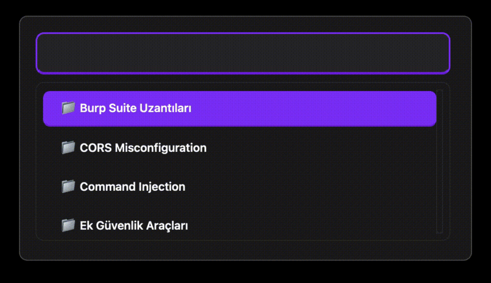

# Cyn0 - Cybersecurity Payload Manager

**Instant access to security testing payloads, commands, and techniques.**


<div align="center">
  


*Lightning-fast access to security payloads with `Shift + Space`*

</div>

---

Cyn0 is a cross-platform desktop application designed for penetration testers, security researchers, and bug bounty hunters. Access thousands of security payloads, exploitation techniques, and commands with lightning-fast search and intelligent payload copying.

## Features

### Core Functionality
- **Global Hotkey Access** - Press `Shift + Space` anywhere to instantly open Cyn0
- **Fast Search** - Real-time search across 100+ security categories
- **Intelligent Payload Copying** - Auto-detect and copy payloads with keyboard shortcuts
- **Personal Notes** - Secure local notes with encryption, favorites, tags, and auto-backup
- **Comprehensive Database** - Web exploits, Linux/Windows commands, OSINT tools, and more

### Keyboard-First Design
- Arrow keys for navigation
- `Enter` to select
- `Backspace/Delete` to go back
- `Shift + Arrows` to navigate between payloads
- `Shift + Ctrl/Cmd + C` to copy selected payload
- `Ctrl/Cmd + N` for quick actions menu
- `Ctrl/Cmd + F` for search mode

### Smart Features
- **Payload Auto-Detection** - Automatically identifies code blocks, commands, and payloads
- **Backup System** - SHA256-based backup with restore functionality
- **Stay-on-Top** - Always accessible, never lost behind other windows
- **System Tray** - Runs quietly in the background

## Installation

### Prerequisites

**All Platforms:**
- Qt 6.9+ (Core, Widgets, GUI)
- C++17 compiler
- CMake or qmake

**Linux Additional:**
```bash
# Ubuntu/Debian
sudo apt install libx11-dev libxkbcommon-x11-dev

# Fedora/RHEL
sudo dnf install libX11-devel libxkbcommon-x11-devel
```

### Pre-built Binaries (Recommended)

Download the latest release for your platform from [GitHub Releases](https://github.com/yourusername/cyn0/releases):

- **Windows:** `Cyn0-Windows-x64.zip`
- **macOS:** `Cyn0-macOS.dmg`
- **Linux:** `Cyn0-Linux-x86_64.AppImage`

### Building from Source

```bash
# Clone the repository
git clone https://github.com/yourusername/cyn0.git
cd cyn0

# Build using qmake
qmake Cyn0.pro
make

# Or using Qt Creator
# Open Cyn0.pro in Qt Creator and build
```

**Platform-Specific Instructions:**

**macOS:**
```bash
# Build
qmake Cyn0.pro
make

# Run
open Cyn0.app

# Create DMG (optional)
macdeployqt Cyn0.app -dmg
```

**Linux:**
```bash
# Install dependencies first
sudo apt install libx11-dev libxkbcommon-x11-dev

# Build
qmake Cyn0.pro
make

# Run
./Cyn0
```

**Windows:**
```cmd
# Build (Qt environment required)
qmake Cyn0.pro
nmake

# Run
release\Cyn0.exe
```

## Quick Start Guide

### First Launch

1. **Launch Cyn0** - The app runs in the system tray
2. **Press `Shift + Space`** - Opens the main window
3. **Start Typing** - Search begins automatically
4. **Navigate** - Use arrow keys to browse categories
5. **Select** - Press Enter to view content

### Using the Search

```
Type: "xss"
Results: XSS Payloads, XSS Tools, WAF Bypass Techniques

Type: "privilege"
Results: Linux Privilege Escalation, Windows Privilege Escalation

Type: "sql"
Results: SQL Injection, SQLMap Commands, MySQL Exploitation
```

### Copying Payloads

When viewing content with payloads (e.g., XSS attacks):

1. **First payload auto-selected** - Highlighted in purple
2. **Navigate** - `Shift + ↓/↑` to move between payloads
3. **Copy** - `Shift + Ctrl/Cmd + C` to copy to clipboard
4. **Quick Copy & Close** - `Shift + Enter` copies and closes window

### Personal Notes

**Create a Note:**
1. Press `Ctrl/Cmd + N`
2. Select "Quick Add Note"
3. Fill in title, content, and tags
4. Click Save

**Manage Notes:**
- Press `Ctrl/Cmd + N` → "View My Notes"
- ⭐ Click star to favorite
- 🏷️ Use tags for organization
- Search notes by title, content, or tags

**Backup & Restore:**
- Press `Ctrl/Cmd + N` → "Backup Manager"
- View all backups with SHA256 hashes
- Restore from any backup point
- Delete old backups

## Keyboard Shortcuts

### Global
| Shortcut | Action |
|----------|--------|
| `Shift + Space` | Toggle Cyn0 visibility |

### Main Window
| Shortcut | Action |
|----------|--------|
| `↑/↓` | Navigate items (normal mode) |
| `Enter` | Select/Open item |
| `Backspace/Delete` | Go back |
| `Ctrl/Cmd + F` | Focus search bar |
| `Ctrl/Cmd + N` | Quick actions menu |
| `Esc` | Hide window |

### Payload Mode
| Shortcut | Action |
|----------|--------|
| `Shift + ↓/↑` | Navigate between payloads |
| `Shift + Ctrl/Cmd + C` | Copy selected payload |
| `Shift + Enter` | Copy and close window |

### Notes
| Shortcut | Action |
|----------|--------|
| `Ctrl/Cmd + N` | Quick note dialog |
| `Ctrl/Cmd + S` | Save note |
| `Ctrl/Cmd + F` | Search notes |

## Database Categories

### Web Security
- XSS Payloads & Bypasses
- SQL Injection
- SSTI (Server-Side Template Injection)
- Command Injection & Unicode Bypass
- CORS Misconfiguration
- File Upload Bypass
- GraphQL Exploitation
- JWT & API Security
- LFI/RFI Exploitation
- OAuth 2.0 Attacks
- SSRF Exploitation
- WAF Bypass Techniques
- WebSocket Security
- XXE Exploitation
- Web Fuzzing Tools
- Vulnerability Scanners

### Linux
- Advanced System Commands
- Metasploit Modules
- MySQL Exploitation
- NFS Enumeration
- Privilege Escalation
- RDP Enumeration
- Redis Exploitation
- SMB Enumeration
- Specialized Security Tools
- Terminal Commands

### Windows
- PowerShell Basics
- PowerShell Commands
- Privilege Escalation
- Registry Commands
- Service Commands

### OSINT & Recon
- OSINT Tools Database
- Recon Tools
- Google Dork Database
- GitHub Security Resources

### Additional Tools
- Burp Suite Extensions
- Steganography Tools
- Python Security Commands

## Configuration

### Changing Global Hotkey

Edit `mainwindow.cpp` (line 47):
```cpp
hotkey = new QHotkey(QKeySequence("Shift+Space"), true, this);
```

Available modifiers: `Ctrl`, `Shift`, `Alt`, `Meta` (Win/Cmd)

### Data Storage Locations

**Personal Notes:**
```
macOS: ~/Library/Application Support/Cyn0/personal_notes.json
Windows: %APPDATA%/Cyn0/personal_notes.json
Linux: ~/.local/share/Cyn0/personal_notes.json
```

**Backups:**
```
~/.config/Cyn0/backups/
```

## Security & Legal Notice

**⚠️ IMPORTANT DISCLAIMER**

This tool is intended for:
- ✅ Authorized security testing
- ✅ Educational purposes
- ✅ Bug bounty programs
- ✅ Penetration testing with proper authorization
- ✅ CTF competitions
- ✅ Security research

**Prohibited Use:**
- ❌ Unauthorized access to systems
- ❌ Malicious activities
- ❌ Illegal hacking
- ❌ Violation of computer fraud laws

**Users are solely responsible for ensuring they have proper authorization before using any techniques or payloads contained in this tool.**

## Privacy & Data Security

- **100% Local** - All data stored locally, no cloud connections
- **No Telemetry** - Zero tracking or analytics
- **Encrypted Backups** - SHA256 hashing for backup integrity
- **Open Source** - Full transparency, audit the code yourself

## Known Issues

### macOS
- **Accessibility Permissions Required** - Grant permissions in System Preferences → Security & Privacy → Accessibility
- **First Launch** - May require right-click → Open to bypass Gatekeeper

### Linux
- **X11 Required** - Wayland support limited (use X11 session)
- **Global Hotkey** - May conflict with desktop environment shortcuts

### Windows
- **Antivirus False Positives** - Some AVs flag global hotkey usage (add exception)

### Adding Payloads/Commands

Edit JSON files in the project root or `json/` directory. Format:

```json
{
    "Category Name": {
        "desc": "Description of the technique",
        "commands": [
            {
                "desc": "What this command does",
                "command": "actual command here"
            }
        ],
        "examples": [
            {
                "desc": "Example scenario",
                "command": "example usage"
            }
        ]
    }
}
```

## Credits

**Built with:**
- [Qt Framework](https://www.qt.io/) - Cross-platform GUI
- [QHotkey](https://github.com/Skycoder42/QHotkey) - Global hotkey support

**Payload Sources:**
- [PayloadsAllTheThings](https://github.com/swisskyrepo/PayloadsAllTheThings)
- [HackTricks](https://book.hacktricks.xyz/)
- [OWASP](https://owasp.org/)
- Community contributions

## License

MIT License - See [LICENSE](LICENSE) file for details.

## Support

- **Issues:** [GitHub Issues](https://github.com/yourusername/cyn0/issues)
- **Discussions:** [GitHub Discussions](https://github.com/yourusername/cyn0/discussions)

## Acknowledgments

Special thanks to the security community for sharing knowledge and techniques. This tool stands on the shoulders of giants.

**Stay ethical. Stay legal. Happy hacking! 🔒**


